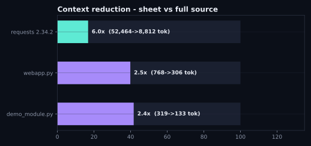
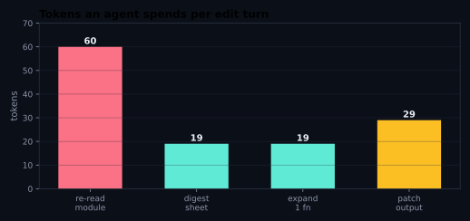
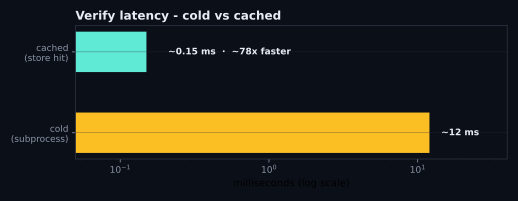
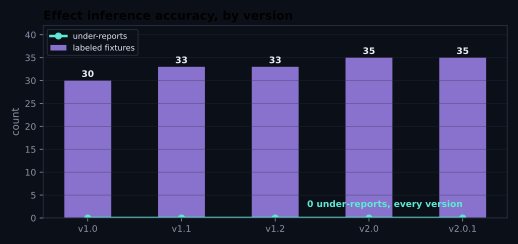
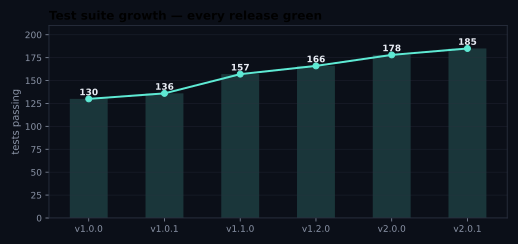

# Benchmarks — Sigil v2.0.1

Every number is produced by `scripts/benchmark.py` from the actual package and
artifacts in this repo. Token counts use a real production BPE tokenizer (the
Claude BPE bundled offline with `anthropic` 0.3.x; the script prefers
`tiktoken cl100k_base` when its vocabulary is cached). Reproduce:

```bash
python3 scripts/benchmark.py          # human-readable
python3 scripts/benchmark.py --json   # machine-readable
python3 scripts/benchmark.py --plots  # regenerate docs/img/*.svg (needs matplotlib)
```

The charts below are also rendered live (and version-annotated) on the project
hero page — open `site/index.html` and scroll to **Benchmarks, visualized**.

Timing figures were measured in the build sandbox (Linux, Python 3.10) and will
vary by machine; the *ratios* are robust, the absolute ms are not.

## Context reduction (first contact)



| source | full source | digest sheet | reduction |
|---|---|---|---|
| demo_module.py (4 fns) | 319 tok | 133 tok | 2.4x |
| lift-legacy webapp.py (15 fns) | 768 tok | 306 tok | 2.5x |
| requests 2.34.2 (6,385 lines, 302 defs) | 52,464 tok | 8,812 tok | **6.0x** |

The neutral-IR sheets (v2.0) are marginally tighter than the v1 Python-AST
sheets — 6.0x on requests, up from 5.9x. The spec's eyeballed "10x+" still does
not survive measurement at first contact.

## Iteration turn (where the real savings are)



A single agent edit turn, measured end to end:

| context route | tokens |
|---|---|
| re-read the whole module fresh | 60 |
| digest sheet (cache-eligible, R1) | 19 |
| expand one implementation (R2) | 19 |
| patch op emitted (R3, output side) | 29 |

On a real repo the sheet (8,812 cached tokens for all of requests) is billed at
cached-input rates, edits expand ~20-150 tokens, and a patch is ~30 output
tokens — versus re-reading 52k fresh tokens per turn. That is where the >10x
compounding lives.

## Verification latency



| | median |
|---|---|
| cold verify (subprocess, contracts run) | ~12 ms |
| **cached verify (store hit, unchanged code)** | **~0.15 ms** |
| speedup on a hit | **~78x** |

A cache hit is a content-addressed file read + JSON parse — sub-millisecond, far
under the original "<50 ms" gate. Timeouts and errors are never cached
(D-019); pass/fail are cached forever (hashes are immutable).

## Effect inference (the security-critical metric)



| | value |
|---|---|
| labeled fixtures | 35 |
| labeled functions | 39 |
| **under-reports** | **0** |
| over-report rate | 2.4% |

Zero under-reporting is the prime directive — a missed effect is a security bug,
an over-reported one is acceptable noise. Held across every fixture, including
the read/write-mode and `!db` cases added in v1.1.

## Test suite growth



130 → 185 tests across six releases (v1.0.0 → v2.0.1); every release shipped
with the full suite green and tagged, each exit gate written as a failing test first.

## Lift throughput

| | value |
|---|---|
| input | 6,385 lines, 302 definitions (requests 2.34.2) |
| time | ~0.08 s |
| **rate** | **~3,800 defs/s (~79,000 lines/s)** |

Lifting is parse + canonicalize + hash; no code executes. A full mid-size
library lifts in well under a second.

## IR round-trip stability (v2.0)

| | value |
|---|---|
| modules checked (requests snapshot) | 19 |
| hash-stable through lower -> render -> re-lower | **19/19 (100%)** |

The language-neutral IR projects back to source and re-lifts to an identical
hash on every module in the snapshot — the property that lets patches and
`expand` operate on the IR safely.
